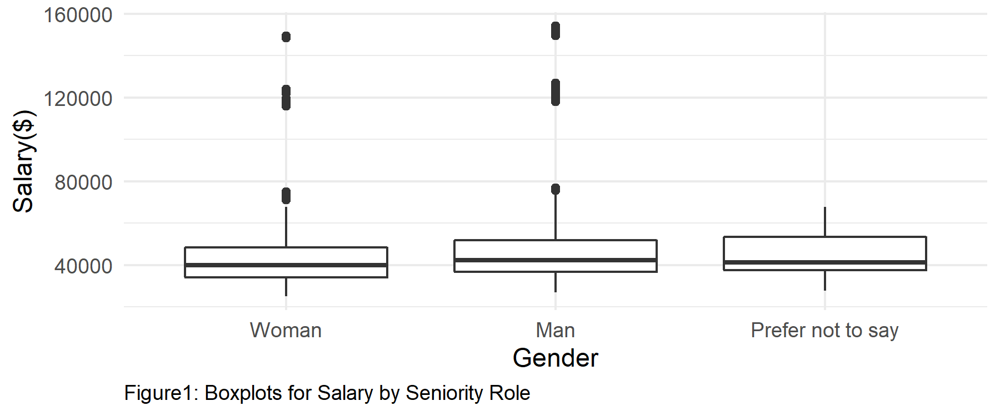

```{r, message = FALSE, echo=FALSE}
library(tidyverse)
library(lme4)
library(mgcv)
library(kableExtra)
# this should supress all code and messages
knitr::opts_chunk$set(include=FALSE)
```

# General comments (you can delete this section)

_You can delete this section, and if you want to check what it said, just open a template from the package again. You don't have to use this particular template, but you DO need to write you report in RMarkdown and include a cover page._

_The cover page must have:_

*	_A title and subtitle_
* _"Report prepared for Black Saber Software by" your company name_
*	_Date (assessment submission date is fine)_

_You can change the colour of this cover to any colour you would like by replacing 6C3082 in the YAML above (line 11) to another hex code. You could use this tool to help you:_ https://htmlcolorcodes.com/color-picker/

\newpage
# Executive summary

_Guidelines for the executive summary:_

* _No more than two pages_
* _Language is appropriate for a non-technical audience_
* _Bullet points are used where appropriate_
*	_A small number of key visualizations and/or tables are included_
*	_All three research questions are addressed_


\newpage
# Technical report
_This part of the report is much more comprehensive than the executive summary. The audience is statistics/data-minded people, but you should NOT include code or unformatted R output here._


## Introduction

_Provide a brief introduction to your report and outline what the report will cover. This section is valuable for setting scope and expectations. _
The present report investigates whether employees in Black Saber Software gets hired, promoted, and receives salary by their talents and values to the company, with a special focus on gender biases exist in any of these processes. 


### Research questions
_Use bullet points to to describe the research questions you are going to address. Write in full sentences._

-Salary: The focus of our question regarding salary was whether employees receives their salary purely based on their values to the company. In particular, we were interested in whether gender has significant influence on the salary when we fit a regression model and set salary as response since if gender does have significant influence, it would be an indication that the Black Saber Software company differentially distributes salary to employees based on their gender.

What kind of employees on this company get a higher salary when the quarter changes? What factors, such as gender, team, role, leadership level, productivity, are related to increased rate of salary? Among those who get a higher salary compared to the previous quarter, to what extent is gender associated with salary increase rate? It is commonly assumed that males have more advantages than females. Is this true on Black Saber Software? 

2) 
Promotion: What factors, such as gender, leadership level, and productivity, are potentially affecting the number of promotions of employees at the Black Saber Software? Is the common assumption that male employees are more likely to be promoted than female employees also true at the Black Saber Software?

3) Hiring process: The purpose of this survey is to see whether there is gender bias throughout the hiring phase (This can be a general question). Then (as specific questions), we can see whether there is bias within algorithms AND humans (the recruiters and interviewers?). 


## A Potential Gender Bias in Salary
_For each research question, you will want to briefly describe any data manipulation, show some exploratory plots/summary tables, report on any methods you use (i.e. models you fit) and the conclusions you draw from these_

We first changed the salary variable in black_saber_current_employees.csv file from characters to doubles so that we can fit a regression model with the salary variable as a response. We removed the dollar sign in the front and a comma sign that separates the thousands value. Then, we reordered the factor level of the employee's seniority of role such that it matches the actual hierarchy in the company rather than alphabetical order. We also set woman as the baseline for gender variable so that we can make compairsons of salary and promotion by gender easily (see appendix for more information).


```{r}
############################################################################################################
#DATA CLEANING PART
############################################################################################################

# read in the data
black_saber_current_employees <- read_csv("data/black-saber-current-employees.csv")

#change salary varaible from characters to doubles
black_saber_current_employees_cleaned <- black_saber_current_employees %>% 
  mutate(salary = str_extract_all(salary, "\\d+,\\d+")) %>% #only extracting the number part(i.e., remove $)
  mutate(salary = str_remove_all(salary, ",")) %>% # remove comma(,)
  mutate(salary = as.numeric(salary)) %>% #change to doubles
  #changing the orders of role as hierarchy, rather than alphabetical order(see below note)
  mutate(role_seniority = fct_relevel(role_seniority, "Manager", after = 7)) %>% 
  mutate(role_seniority = fct_relevel(role_seniority, "Director", after = 7)) %>%
  #changing the orders of gender for clairty in explanation for promotion analaysis part
  mutate(gender = fct_relevel(gender, "Woman", after = 0)) %>%
  rename("Team" = team) #for clean data visualization

#NOTES
#(Before changing): Director Entry-level Junior I Junior II Manager Senior I Senior II Senior III Vice president
#(After chaning): “Entry-level”,“Junior I”,“JuniorII”,“Senior I”,“Senior II”,“Senior III”,“Manager”, “Director”,“Vicepresident” 

```


Based on the data of current employees that we received,  leadership level, and productivity of an employee seemed to be the variables that describes the employee's value to the company. However, we also suspected that team and seniority of role will also have fixed effect on salary since based on those variables, the employee will have differential value to the company:
For team, some team might be important and valuable to the company because Black Saber is a software company.
For seniority of role, the higher position an employee takes, the more challenging work they have to do. 
To figure out whether such sepculation is true, we fitted a boxplot. 


```{r}
#########################################################################################################
#EXPLORATORY ANALYSIS
#########################################################################################################
# create a visualisation (a boxplot to see if teams have systematic differences in their salary)
#rationale is that 


#exploring whether there is difference in salary by roles and by teams.
#there should be difference, since higher the role, the more salary people earn since they are more valuable to the company
#andsome teams might be more important to the company 
#e.g., bc it is a software company, software team might be more valuable to the company and thus receive higher salary, yet is fair in the sense that the Gideon wants salary based on "talent and value to the company”)

my_plot_salary_by_role_team <- black_saber_current_employees_cleaned %>% 
  ggplot(aes(x = role_seniority, y = salary, color = Team)) +
  geom_boxplot() +
  theme_minimal() +
  labs(title = "Boxplots for Salary by Seniority of Role", x="Role Seniority", y= "Salary($)") +
  theme(plot.title = element_text(hjust = 0.5), legend.position = c(0.15, 0.65)) 

my_plot_salary_by_role_team

ggsave("images/salary_boxplot_role_team.png", width = 8, height = 6)

#side note: does follow the seniority trend, which is Least senior to most senior: “Entry-level”,“Junior I”,“JuniorII”,“Senior I”,“Senior II”,“Senior III”,“Manager”, “Director”,“Vicepresident”

```


Indeed, we see that salary significantly depends on the person's role seniority level as well as the team they are in. In particular, manager, director, vice president receives salaries significantly different from other positions, the software teams generally receives higher salary than other teams as we can see from the pink boxplots. Thus, we will also include team and seniority or role as predictors to a regression model.

Below is a boxplot of whether there is a gender difference in salary. Although it does not seem to have sysemtatic difference, when we ran one-way anova setting gender as predictor and salary as response, there was a significant difference (see appendix), but we do need to consider other variables that contributes to the employee's value to the company. Thus, we will see whether a regression model with and without gender as predictor significantly differs after we fit a model and make compairson.

```{r}
#########################################################################################################

#exploring whether there is gender difference in salary
my_plot_salary_by_gender <- black_saber_current_employees_cleaned %>% 
  ggplot(aes(x = gender, y = salary)) +
  geom_boxplot() +
  theme_minimal() +
  labs(title = "Boxplots for Salary by Gender", x = "Gender", y= "Salary($)")
  
my_plot_salary_by_gender
#result(interpretation of the plot): Gender does not seem to have fixed effect on salary. In other words, no gender bias, which is good considering EDI (but when doing model comparison, we will see whether such is true numerically)

ggsave("images/salary_boxplot_gender.png", width = 8, height = 6)

#########ONE-WAY ANOVA ON SALARY AND GENDER AS GROUP####################

lmod_gender <- lm(salary ~ gender, data = black_saber_current_employees_cleaned)
summary(lmod_gender)
#HOWEVER, UNLIKE THE VISUALIZATION, THERE WAS A SIGNIFICANT DIFFERENCE IN GENDER! THERE MIGHT BE GENDER BIAS IN SALARY(we will see this in model fitting part)

```



For a linear regression model, we chose linear mixed effects model because financial quarter will also produce sysemtatic difference, since in financial quarters where Black Saber earns a lot of money, employees will receive bonus, for instance. However, we are not interested in this variable because we only care about the employee's value and so we added this as random intercept.

```{r}
#########################################################################################################
#MODEL FITTING
#########################################################################################################

#fitting a linear mixed model while setting financial quarter (financial_q)
#rationale: in some quarters, the company earns a lot of money and so all employees earn more money in that quarter, but when the quarter is not good, all earn less money.

salary_lmer <- lmer(salary ~ gender + Team + role_seniority + leadership_for_level + productivity + (1|financial_q), data = black_saber_current_employees_cleaned)
#summary(salary_lmer)

#cannot take face-value to whether team has systematic difference and so just to check, we added this model without team so that when we compare it with salary_lmer, we can know whether we must include team or not fpre better prediction.
salary_lmer_no_team <- lmer(salary ~ gender + role_seniority + leadership_for_level + productivity + (1|financial_q), data = black_saber_current_employees_cleaned)
#summary(salary_lmer)

salary_lmer_no_gender <- lmer(salary ~ Team + role_seniority + leadership_for_level + productivity + (1|financial_q), data = black_saber_current_employees_cleaned)
#summary(salary_lmer_no_gender)

```

Below is the result of maximum likelihood test with and without gender as predictor. Since the p-value is significant, we have no evidence against the claim that simpler model is better. In other words, we should go with the complex model, which is the model that includes gender as predictor, to have better predictive ability for salary. This result implicates that gender cause notable difference in salary and so there is indeed a gender bias in salary.

```{r, echo=TRUE}
#########################################################################################################
#MODEL COMPARISION TEST
#########################################################################################################


#THIS TEST CONFRIMS THAT THERE IS A GENDER BIAS IN SALARY
lmtest::lrtest(salary_lmer, salary_lmer_no_gender)
#conclusion: indeed, becuase the p-value is significant, simpler model does NOT explain better than complex model = should include gender to have better predictive ability...

```
Note that we also tested whether we should include team as predictor for salary becuase it might be ambiguous of whether team has fixed effect on salary based on the above plot as compared to seniority of role. The result showed that we should also include team (see appendix).
```{r}
#This test confirms that we need team as predictor
lmtest::lrtest(salary_lmer, salary_lmer_no_team)
```

In conclusion, there is a gender bias in salary since gender improves salary prediction above and beyond inclusion  of other variables, which are the factors that show the employee's value to Black Saber Software. 

## Informative title for section addressing a research question(PROMOTION)

```{r}
############################################################################################################
#DATA CLEANING PART
############################################################################################################

# create a new variable called `employee_role` which saves role_seniority as numbers and
# create another variable called `initial_role` that indicates the initial role of the employee
role_seniority_data <- black_saber_current_employees_cleaned %>% 
  mutate(employee_role = as.numeric(role_seniority)) %>%
  select(employee_id, employee_role) %>%
  unique()%>%
  group_by(employee_id)%>%
  mutate(initial_role=min(employee_role)) %>%
  mutate(current_role=max(employee_role))

# filter from the role_seniority_data to only include people with 
# their current roles different from their initial roles
# create a new variable called `promoted` to indicate whether the employee has been promoted 
# from their initial role
promoted_only_data <- role_seniority_data%>%
  filter(current_role!=initial_role) %>%
  mutate(promoted = 1) %>%
  filter(current_role==employee_role)

# insert `promoted` variable to the black_saber_current_employees_cleaned data
# replace NA's in the `promoted` column with 0
promotion_data <- full_join(black_saber_current_employees_cleaned, promoted_only_data) %>%
  select(-c(employee_role, initial_role, current_role)) %>% 
  mutate(promoted = replace_na(promoted, 0))

# `work_period` variable counts how many financial quarters each employee has gone through
# this gives us an idea of how long each employee has been working at the company
working_period <- black_saber_current_employees_cleaned %>%
  group_by(employee_id) %>%
  summarise(work_period = n())

# combined promotion_data and working_period
promotion_data <- full_join(promotion_data, working_period)

# data that only contains the most recent (2020 Q4) information on each employee
recent_employee_data <- promotion_data %>%
   mutate(year = as.numeric(str_extract_all(financial_q, "\\d+\\d+"))) %>%
   mutate(quarter = as.numeric(substr(financial_q,7,7))) %>% 
   group_by(employee_id) %>%
   mutate(recent_year = max(year)) %>%
   filter(year == recent_year) %>%
   mutate(recent_quarter = max(quarter)) %>%
   filter(quarter == recent_quarter) %>%
   right_join(y = role_seniority_data) %>% 
   filter(employee_role == current_role) %>% 
   select(-c(year, quarter, recent_year, recent_quarter, current_role, employee_role, initial_role))

#########################################################################################################
#EXPLORATORY ANALYSIS
#########################################################################################################

# exploring whether there is gender difference in promotion status

promotion_status_by_gender <- promotion_data %>% 
  ggplot(aes(x = gender, fill = as.factor(promoted))) +
  geom_bar(position = "fill") +
  theme_minimal() +
  scale_fill_manual(values=c("#9999CC", "#6C3082")) +
  labs(title = "Barplot for Promotion Status by Gender")

promotion_status_by_gender

# exploring whether there is a difference in promotion status according to working period

promotion_status_by_working_period <- promotion_data %>% 
  ggplot(aes(x = work_period, fill = as.factor(promoted))) +
  geom_bar(position = "fill") +
  theme_minimal() +
  scale_fill_manual(labels = c("Never got promoted", "Got promoted at least once"),
                    values=c("#9999CC", "#6C3082")) +
  labs(title = "Boxplots for Promotion Status by Working Period",
       x = "Number of quarters spent at the company",
       fill = "Promotion status"
       )

# proportion of people who have been promoted for at least once by the working period 
# (according to the number of financial quarters spent at the company)
promotion_status_by_working_period <- recent_employee_data %>%
  group_by(work_period) %>%
  summarise(count = n(), promoted_proportion = sum(promoted)/count) %>%
  select(-count) 

# this table could go into the appendix
kable(promotion_status_by_working_period, caption = "Proportion of promoted employee by their working period", booktabs = TRUE, valign = "t") %>%
  kable_styling(latex_options = "hold_position")

#########################################################################################################
#MODEL FITTING
#########################################################################################################

promotion_model1 <- glm(promoted ~ gender + leadership_for_level + productivity + work_period, family = binomial(link = "logit"), data = recent_employee_data)

summary(promotion_model1)

# Goodness-of-fit test for promotion_model1
mod1_p_value <- 1 - pchisq(promotion_model1$deviance, promotion_model1$df.residual)
mod1_p_value
# no evidence against the significant lack of fit

# Should we consider to include `team` variable in the model? If so, should it be a random effect?
promotion_model2 <- glmer(promoted ~ gender + leadership_for_level + productivity + work_period + (1 | Team), family = binomial(link = "logit"), data = recent_employee_data)

conf_int <- confint(promotion_model2)

table <- cbind(round(exp(summary(promotion_model2)$coeff[,1]),2),
               round(exp(conf_int[-1,]),2),
               round(summary(promotion_model2)$coeff[,4], 4))

colnames(table) <- c("Estimate", "Lower Limit", "Upper Limit", "P-value")

knitr::kable(table)
# if we want to create a model with a response that indicates the total number of promotions for each employee,
# we must take different working periods into account.

#########################################################################################################


```

```{r}
# create a variable called promotion count that keeps track of the number of times
# each employee got promoted
test_employee_data <- black_saber_current_employees_cleaned %>%
  mutate(employee_role = as.numeric(role_seniority)) %>%
  select(employee_id, employee_role) %>%
  group_by(employee_id)%>%
  mutate(initial_role=min(employee_role)) %>%
  mutate(current_role=max(employee_role)) %>%
  mutate(promotion_count = current_role - initial_role) %>%
  select(employee_id, promotion_count) %>%
  unique()

# data that only contains the most recent (2020 Q4) information on each employee
test_employee_data <- full_join(black_saber_current_employees_cleaned, test_employee_data) %>%
  left_join(working_period) %>%
  mutate(year = as.numeric(str_extract_all(financial_q, "\\d+\\d+"))) %>%
  mutate(quarter = as.numeric(substr(financial_q,7,7))) %>% 
  group_by(employee_id) %>%
  mutate(recent_year = max(year)) %>%
  filter(year == recent_year) %>%
  mutate(recent_quarter = max(quarter)) %>%
  filter(quarter == recent_quarter) %>%
  right_join(y = role_seniority_data) %>% 
  filter(employee_role == current_role) %>% 
  select(-c(year, quarter, recent_year, recent_quarter, current_role, employee_role, initial_role))


########
# EDA
########

# proportion of different numbers of promotion
prop.table(table(test_employee_data$promotion_count))

# mean number of promotions
mean(test_employee_data$promotion_count)
sd(test_employee_data$promotion_count)

promotion_count_plot <- test_employee_data %>% 
  ggplot(aes(x = promotion_count)) +
  geom_histogram(aes(y = stat(count / sum(count))), colour = "grey", fill = "#6C3082", binwidth= 1) +
  theme_minimal() +
  labs(title = "Distribution of Employees' Number of Promotions", x = "Number of Promotions for employees")

promotion_count_plot


promotion_count_poisson_plot <- ggplot(transform(data.frame(x=c(0:7)), y=dpois(x, lambda = mean(test_employee_data$promotion_count))), aes(x, y)) + 
  geom_bar(stat="identity", fill = "#6C3082") + 
  theme_minimal() +
  labs(title = "Distribution of Poisson Model", x = "Number of Promotions")
  
promotion_count_poisson_plot


promotion_count_by_gender_plot <- test_employee_data %>% 
  ggplot(aes(x = promotion_count, fill = gender)) +
  geom_histogram(colour = "grey", binwidth= 1) +
  theme_minimal() +
  labs(title = "Distribution of Employees' Number of Promotions", x = "Number of Promotions for employees") + 
  scale_fill_manual(values=c("#6666CC", "#6C3082","#9999CC"))

promotion_count_by_gender_plot

# test model to see if gender, leadership level and productivity of each employee affect their number of promotions
# (offset: account for different work periods for the employees, while allowing for counts to still be the response.)
mod1 <- glm(promotion_count ~ gender, family = poisson, offset = log(work_period), data = test_employee_data)

mod2 <- glm(promotion_count ~ gender + leadership_for_level, family = poisson, offset = log(work_period), data = test_employee_data)

mod3 <- glm(promotion_count ~ gender + leadership_for_level + productivity, family = poisson, offset = log(work_period), data = test_employee_data) 

lmtest::lrtest(mod1, mod2, mod3)
round(coef(summary(mod1)),4)
round(confint(mod1),4)

mod4 <- glmer(promotion_count ~ gender + (1|Team), family = poisson, offset = log(work_period), data = test_employee_data)
# mod4 suggests that having the random effect for `team` may be meaningless since the random effect is very small.


```


## Informative title for section addressing a research question

# Q3 

## data wrangling
```{r}
#read data
phase1_applicants <- read.csv("data/phase1-new-grad-applicants-2020.csv")
phase2_applicants <- read.csv("data/phase2-new-grad-applicants-2020.csv")
phase3_applicants <- read.csv("data/phase3-new-grad-applicants-2020.csv")
final_hired <- read.csv("data/final-hires-newgrad_2020.csv")

#make new variable which tells whether applicant is accepted for each phase or not
final_hired_cleaned <- final_hired %>% 
  mutate(hired = 1)

phase3_applicants_cleaned <- phase3_applicants %>% 
  mutate(phase2accepted = 1) %>% 
  full_join(final_hired_cleaned) %>% 
  mutate(hired = replace_na(hired, 0)) %>% 
  left_join(phase2_applicants) %>% 
  select(applicant_id, interviewer_rating_1, interviewer_rating_2, gender, hired, phase2accepted)

phase2_applicants_cleaned <- phase2_applicants %>% 
  mutate(phase1accepted = 1) %>% 
  full_join(phase3_applicants_cleaned) %>% 
  mutate(phase2accepted = replace_na(phase2accepted, 0)) %>% 
  select(-interviewer_rating_1, -interviewer_rating_2)

phase1_applicants_cleaned <- phase1_applicants %>% 
  full_join(phase2_applicants_cleaned) %>% 
  mutate(phase1accepted = replace_na(phase1accepted, 0)) %>% 
  select(-technical_skills, -writing_skills, -leadership_presence, -speaking_skills, -phase2accepted)
```

## data exploratory
```{r}
#proportion of female
sum(phase1_applicants$gender == "Woman") / nrow(phase1_applicants)

#stacked bar chart that displays the proportion of applicants with each accepted group, for each gender
ggplot(data = phase1_applicants_cleaned, aes(x = gender, fill = as.factor(phase1accepted))) +
  geom_bar(position = "fill") +
  ylab("Proportion") + 
  scale_fill_grey() +
  theme_minimal() +
  xlab("sex")

#Empirical logit plot
phase3_applicants_graph <- phase3_applicants_cleaned %>%
  group_by(gender) %>%
  mutate(interviewer_rating_1_cut = cut_number(interviewer_rating_1,5))
  
emplogit1 <- phase3_applicants_graph %>%
  group_by(gender, interviewer_rating_1_cut) %>%
  summarise(prop.lose = mean(hired), 
            n = n(),
            midpoint = median(interviewer_rating_1), .groups = "drop") %>%
  mutate(prop.lose = ifelse(prop.lose==0, .01, prop.lose),
         emplogit = log(prop.lose / (1 - prop.lose)))

ggplot(emplogit1, aes(x = midpoint, y = emplogit, color = gender)) +
  #geom_point(aes(shape = gender)) +
  geom_smooth(aes(linetype = gender), 
              method = "lm", formula = "y~x") +
  theme_minimal() +
  scale_color_brewer(palette = "Dark2")
```


## modeling

### phase 1
```{r}
#use generalized linear model since all variables take large part of grades

#In model0, cannot see significant p-value 
#model where gender is only predictor
model0 <- glm(phase1accepted ~ gender, family = binomial, data = phase1_applicants_cleaned)
summary(model0)

model1 <- glm(phase1accepted ~ team_applied_for + cover_letter + cv+ gpa + extracurriculars + work_experience, family = binomial(link = "logit"), data = phase1_applicants_cleaned)

model2_w_gender <- glm(phase1accepted ~ team_applied_for + cover_letter + cv+ gpa + gender +  extracurriculars + work_experience, family = binomial(link = "logit"), data = phase1_applicants_cleaned)

drop_in_deviance <- anova(model1, model2_w_gender, test = "Chisq")
drop_in_deviance
```

Since confidence interval of all genders includes 0, at the 95% confidence level, it is believable that male applicants and female applicants with applicants who prefer not to say gender have the same odds of accepted by AI in phase 1. We will see more carefully that AI is biased with gender with other variables in phase 1.

The deviance test tells us that it is not preferable that adding gender as an indicator variable to the model. The deviance difference between models with gender and without gender is 1.21, which is pretty small. Also, the large p-value also supports that adding new indicator variable, which is gender, to the model with all the other variables is not helpful.

### phase 3
```{r}
model0_3 <- glm(hired ~ interviewer_rating_1 + interviewer_rating_2, data = phase3_applicants_cleaned)
model1_3 <- glm(hired ~ interviewer_rating_1 + interviewer_rating_2 + gender, data = phase3_applicants_cleaned)
anova(model0_3, model1_3, test = "Chisq")
```

The deviance test tells us that it is not preferable that adding gender as an indicator variable to the model. The deviance difference between models with gender and without gender is 0.23, which is pretty small. Even though the p-value is not that big, we can still say model with gender does not gives better prediction for hiring results in the interview in phase 3.

## Discussion

_In this section you will summarize your findings across all the research questions and discuss the strengths and limitations of your work. It doesn't have to be long, but keep in mind that often people will just skim the intro and the discussion of a document like this, so make sure it is useful as a semi-standalone section (doesn't have to be completely standalone like the executive summary)._

### Strengths and limitations

\newpage
# Consultant information
## Consultant profiles

*Complete this section with a brief bio for each member of your group. If you are completing the project individually, you only need to complete one for yourself. In that case, change the title of this section to 'Consultant profile' instead. Examples below. This section is only marked for completeness, clarity and professionalism, not 'truth' so you can write it as if we're a few years in the future. Put your current degree in as completed and/or add your first choice grad school program, whatever you like. What skills related skills would you most like to highlight? What job title do you want?*

**Statsy McStatsstats**. Statsy is a senior consultant with Eminence Analytics. She specializes in data visualization. Statsy earned her Bachelor of Science, Specialist in Statistics Methods and Practice, from the University of Toronto in 2023.

**Datana Scatterplot**. Datana is a junior consultant with Eminence Analytics. They specialize in reproducible analysis and statistical communication. Datana earned their Bachelor of Science, Majoring in Computer Science and Statistics from the University of Toronto in 2024.

**Yoon Young Lee**. Yoon Young is a junior data analyst with KoCad. She specializes in data visualization and data analysis. Yoon Young earned her Bachelor of Science, Specializing in Psychology and Majoring in Statistics from the University of Toronto in 2022. 

**Guemin Kim**. Guemin is a junior data analyst with KoCad. She specializes in machine learning and statistical communication. Guemin earned her Bachelor of Science, Majoring in Actuarial Science and Statistics from the University of Toronto in 2022.

## Code of ethical conduct

_This section should be fairly short, no more than half a page. Assume a general audience, much like your executive summary._

* _Make at least three relevant statements about your company’s approach to ethical statistical consulting. These should be appropriately in line with professional conduct advice like the (Statistical Society of Canada Code of Conduct)[https://ssc.ca/sites/default/files/data/Members/public/Accreditation/ethics_e.pdf] or the (Ethical Guidelines for Statistical Practice from the American Statistical Society)[https://www.amstat.org/ASA/Your-Career/Ethical-Guidelines-for-Statistical-Practice.aspx]. For example, "the customer is always right" ISN’T the type of thing an ethical statistical consultant would include._
*	_Be very careful not to just copy and paste from these other documents! Put things in your own words._


__Final advice: KNIT EARLY AND OFTEN!__
