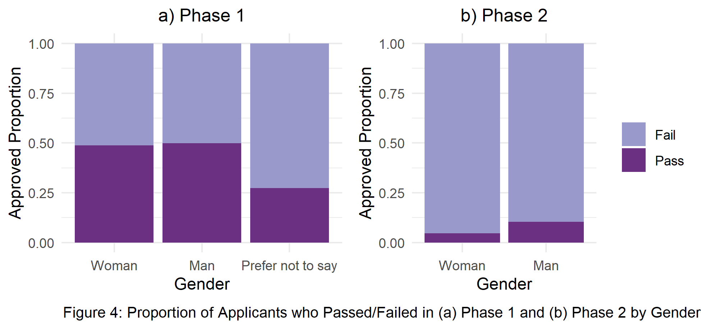

```{r, message = FALSE, echo=FALSE}
library(tidyverse)
library(lme4)
library(mgcv)
library(kableExtra)
#install.packages("gridExtra")
library(gridExtra)
# this should supress all code and messages
knitr::opts_chunk$set(include=FALSE)
```

# General comments (you can delete this section)

_You can delete this section, and if you want to check what it said, just open a template from the package again. You don't have to use this particular template, but you DO need to write you report in RMarkdown and include a cover page._

_The cover page must have:_

*	_A title and subtitle_
* _"Report prepared for Black Saber Software by" your company name_
*	_Date (assessment submission date is fine)_

_You can change the colour of this cover to any colour you would like by replacing 6C3082 in the YAML above (line 11) to another hex code. You could use this tool to help you:_ https://htmlcolorcodes.com/color-picker/

\newpage
# Executive summary

_Guidelines for the executive summary:_

* _No more than two pages_
* _Language is appropriate for a non-technical audience_
* _Bullet points are used where appropriate_
*	_A small number of key visualizations and/or tables are included_
*	_All three research questions are addressed_


\newpage
# Technical report
_This part of the report is much more comprehensive than the executive summary. The audience is statistics/data-minded people, but you should NOT include code or unformatted R output here._


## Introduction

Society has been discriminating against women. They received unequal opportunities to get a job and earn money based on their assets. With increasing concern about EDI, companies are moving toward implementing EDI initiatives. The present report investigated whether employees in Black Saber Software got hired, promoted, and received salary based on their values to the company and, not by discriminatory factor like gender. We first investigated whether salary was fair and not influenced by one's gender. Then, we addressed whether how many times a person got promoted is fair by investigating the relationship between factors related to employee's talent and promotion frequency. Also, we explored whether the hiring process using trialling AI was fair and whether the interviewer rated job applicants based on their talents. Finally, we discussed the limitations and strengths of our methods and suggested a future direction for improvement.


### Research questions
_Use bullet points to to describe the research questions you are going to address. Write in full sentences._

**Salary**

The focus of our question regarding salary was whether employees receives their salary purely based on their values to the company. In particular, we were interested in:
 
 - What factors, such as gender, team, role, leadership level, productivity, are related to increased rate of salary?
 - Whether gender has significant influence on the salary when we fit a regression model and set salary as response. This will tell us whether Black Saber Software company differentially distributes salary to employees based on their gender.


**Promotion** 

 - What factors, such as gender, leadership level, and productivity, are potentially affecting the number of promotions of employees at the Black Saber Software?
 - Is the common assumption that male employees are more likely to be promoted than female employees also true at the Black Saber Software?

**Hiring process**

 - Is there a gender bias throughout the hiring phase, especially phase 1 and 2 which used AI service?


## A Potential Gender Bias in Salary
For data wrangling, we first changed the salary variable in black_saber_current_employees.csv file from characters to doubles so that we can fit a regression model with the salary variable as a response. We removed the dollar sign in the front and a comma sign that separates the thousands value. Then, we reordered the factor level of the employee's seniority of role such that it matches the actual hierarchy in the company rather than being in an alphabetical order. We have also set woman as the baseline for gender variable so that we can make comparisons of each of salary and promotion by gender easily.

```{r}
############################################################################################################
#DATA CLEANING PART
############################################################################################################

# read in the data
black_saber_current_employees <- read_csv("data/black-saber-current-employees.csv")

#change salary varaible from characters to doubles
black_saber_current_employees_cleaned <- black_saber_current_employees %>% 
  mutate(salary = str_extract_all(salary, "\\d+,\\d+")) %>% #only extracting the number part(i.e., remove $)
  mutate(salary = str_remove_all(salary, ",")) %>% # remove comma(,)
  mutate(salary = as.numeric(salary)) %>% #change to doubles
  #changing the orders of role as hierarchy, rather than alphabetical order(see below note)
  mutate(role_seniority = fct_relevel(role_seniority, "Manager", after = 7)) %>% 
  mutate(role_seniority = fct_relevel(role_seniority, "Director", after = 7)) %>%
  #changing the orders of gender for clairty in explanation for promotion analaysis part
  mutate(gender = fct_relevel(gender, "Woman", after = 0))

#NOTES
#(Before changing): Director Entry-level Junior I Junior II Manager Senior I Senior II Senior III Vice president
#(After chaning): “Entry-level”,“Junior I”,“JuniorII”,“Senior I”,“Senior II”,“Senior III”,“Manager”, “Director”,“Vicepresident” 

```


Based on the data of current employees that we received, leadership level and productivity of an employee seemed to be the variables that shows the employee's value to the company. However, we also suspected that team and seniority of role will also have fixed effect on salary since based on those variables, the employee will have differential value to the company. For instance, some teams like software and data team, might be more valuable to the company because Black Saber is a software company. Also, for seniority of role, the higher position an employee takes, the more challenging work they have to do and thus more valuable to the company. 

To figure out whether such speculation is true, we fitted a boxplot. 
```{r}
#########################################################################################################
#EXPLORATORY ANALYSIS
#########################################################################################################
# create a visualisation (a boxplot to see if teams have systematic differences in their salary)
#some teams might be more important to the company 
#e.g., bc it is a software company, software team might be more valuable to the company and thus receive higher salary, yet this is fair in the sense that the Gideon wants salary based on "talent and value to the company”)

my_plot_salary_by_role_team <- black_saber_current_employees_cleaned %>% 
  ggplot(aes(y = salary)) +
  facet_wrap(~team, nrow = 2) +
  geom_boxplot(colour = "grey", fill = "#6C3082") +
  theme_minimal() +
  labs(x = "Team", y= "Salary($)", caption = "Figure1: Boxplots for Salary by Team") +
  theme(plot.caption = element_text(hjust = 0))

my_plot_salary_by_role_team
ggsave("images/salary_boxplot_team.png", width = 6, height = 4)

```


Indeed, the software and data team generally receives higher salary than other teams as we can see from Fig2. Thus, we also included team and seniority of role as predictors to a regression model.


```{r}

#exploring whether there is difference in salary by roles.
#there should be difference, since higher the role, the more salary people earn since they are more valuable to the company

my_plot_salary_by_role <- black_saber_current_employees_cleaned %>% 
  ggplot(aes(x = role_seniority, y = salary)) +
  geom_boxplot(colour = "grey", fill = "#6C3082") +
  theme_minimal() +
  labs(x="Role Seniority", y= "Salary($)", caption = "Figure2: Boxplots for Salary by Seniority Role")

my_plot_salary_by_role
ggsave("images/salary_boxplot_role.png", width = 6, height = 3)

#side note: does follow the seniority trend, which is Least senior to most senior: “Entry-level”,“Junior I”,“JuniorII”,“Senior I”,“Senior II”,“Senior III”,“Manager”, “Director”,“Vicepresident”

```


Also, we see that salary significantly depends on the person's role seniority level as well as the team they are in. In particular, manager, director, vice president receives salaries significantly different from other positions (see Fig1). 

Below is a boxplot of whether there is a gender difference in salary. Although gender does not seem to create sysemtatic difference, the one-way anova of gender as a predictor and salary as a response suggests a significant difference (see appendix). However, we need to see this along with other variables related to an employee's value to the company. Thus, we will see whether a regression model with and without gender as a predictor significantly differs after we fit each model and make comparison.

```{r}
#########################################################################################################

#exploring whether there is gender difference in salary
my_plot_salary_by_gender <- black_saber_current_employees_cleaned %>% 
  ggplot(aes(x = gender, y = salary)) +
  geom_boxplot() +
  theme_minimal() +
  labs(title = "Boxplots for Salary by Gender", x = "Gender", y= "Salary($)")
  
my_plot_salary_by_gender
#result(interpretation of the plot): Gender does not seem to have fixed effect on salary. In other words, no gender bias, which is good considering EDI (but when doing model comparison, we will see whether such is true numerically)

ggsave("images/salary_boxplot_gender.png", width = 5, height = 2)

#########ONE-WAY ANOVA ON SALARY AND GENDER AS GROUP####################

lmod_gender <- lm(salary ~ gender, data = black_saber_current_employees_cleaned)
summary(lmod_gender)
#HOWEVER, UNLIKE THE VISUALIZATION, THERE WAS A SIGNIFICANT DIFFERENCE IN GENDER! THERE MIGHT BE GENDER BIAS IN SALARY(we will see this in model fitting part)

```


We chose a linear mixed effects model for the regression model because financial quarter will also produce sysemtatic difference, since for instance, in financial quarters where Black Saber earns a lot of money, employees will receive bonuses. However, we are not interested in this variable because we only care about the employee's value and so we added this as a random intercept.

```{r}
#########################################################################################################
#MODEL FITTING
#########################################################################################################

#fitting a linear mixed model while setting financial quarter (financial_q)
#rationale: in some quarters, the company earns a lot of money and so all employees earn more money in that quarter, but when the quarter is not good, all earn less money.

salary_lmer <- lmer(salary ~ gender + team + role_seniority + leadership_for_level + productivity + (1|financial_q), data = black_saber_current_employees_cleaned)
#summary(salary_lmer)

#cannot take face-value to whether team has systematic difference and so just to check, we added this model without team so that when we compare it with salary_lmer, we can know whether we must include team or not fpre better prediction.
salary_lmer_no_team <- lmer(salary ~ gender + role_seniority + leadership_for_level + productivity + (1|financial_q), data = black_saber_current_employees_cleaned)
#summary(salary_lmer)

salary_lmer_no_gender <- lmer(salary ~ team + role_seniority + leadership_for_level + productivity + (1|financial_q), data = black_saber_current_employees_cleaned)
#summary(salary_lmer_no_gender)

```

Result of maximum likelihood test with and without gender as predictor while including seniority of role, team, leadership, and productivity as other predictors (see appendix). Since the p-value is significant, we have no evidence against the claim that simpler model is better. In other words, we should go with the complex model, which is the model that includes gender as predictor, to have better predictive ability for salary. This result implicates that gender cause notable difference in salary and so there is indeed a gender bias in salary.

```{r, echo=TRUE}
#########################################################################################################
#MODEL COMPARISION TEST
#########################################################################################################


#THIS TEST CONFIRMS THAT THERE IS A GENDER BIAS IN SALARY
lmtest::lrtest(salary_lmer, salary_lmer_no_gender)
#conclusion: indeed, becuase the p-value is significant, simpler model does NOT explain better than complex model = should include gender to have better predictive ability...

```
Note that we also tested whether we should include team as predictor for salary becuase it might be ambiguous of whether team has fixed effect on salary based on the above plot as compared to seniority of role. The result showed that we should also include team (see appendix).
```{r}
#This test confirms that we need team as predictor
lmtest::lrtest(salary_lmer, salary_lmer_no_team)
```

In conclusion, there is a gender bias in salary since gender improves salary prediction above and beyond inclusion  of other variables, which are the factors that show the employee's value to Black Saber Software. Moreover, such factors not only includes employee's productivity and leadership, but also the team they are in and the role they take in the company. 

## A potential Gender Bias in Promoting Process

```{r}
############################################################################################################
#DATA CLEANING PART
############################################################################################################
# create a variable called promotion count that keeps track of the number of times
# each employee got promoted
employee_data <- black_saber_current_employees_cleaned %>%
  mutate(employee_role = as.numeric(role_seniority)) %>%
  select(employee_id, employee_role) %>%
  group_by(employee_id)%>%
  mutate(initial_role=min(employee_role)) %>%
  mutate(current_role=max(employee_role)) %>%
  mutate(promotion_count = current_role - initial_role) %>%
  select(employee_id, promotion_count) %>%
  unique()

# `work_period` variable counts how many financial quarters each employee has gone through
# this gives us an idea of how long each employee has been working at the company
working_period <- black_saber_current_employees_cleaned %>%
  group_by(employee_id) %>%
  summarise(work_period = n())

# create a new variable called `employee_role` which saves role_seniority as numbers and
# create another variable called `initial_role` that indicates the initial role of the employee
role_seniority_data <- black_saber_current_employees_cleaned %>% 
  mutate(employee_role = as.numeric(role_seniority)) %>%
  select(employee_id, employee_role) %>%
  unique()%>%
  group_by(employee_id)%>%
  mutate(initial_role=min(employee_role)) %>%
  mutate(current_role=max(employee_role))

# data that only contains the most recent (2020 Q4) information on each employee
promotion_data <- full_join(black_saber_current_employees_cleaned, employee_data) %>%
  left_join(working_period) %>%
  mutate(year = as.numeric(str_extract_all(financial_q, "\\d+\\d+"))) %>%
  mutate(quarter = as.numeric(substr(financial_q,7,7))) %>% 
  group_by(employee_id) %>%
  mutate(recent_year = max(year)) %>%
  filter(year == recent_year) %>%
  mutate(recent_quarter = max(quarter)) %>%
  filter(quarter == recent_quarter) %>%
  right_join(y = role_seniority_data) %>% 
  filter(employee_role == current_role) %>% 
  select(-c(year, quarter, recent_year, recent_quarter, current_role, employee_role, initial_role))

```
For this particular topic, employee data that was cleaned in the previous section was used to study several potential factors that affected the company's promoting process. Each line of this data contained information of the 607 employees at the Black Saber Software.

For this analysis, the response variable was the number of promotions per employee after joining the company. Since there may be some employees who have been promoted more than once, it was thought that having a Bernoulli variable (which indicates whether or not an employee has been promoted at least once) as our response would not take into account the variability in different number of promotions of the employees; therefore, we chose our response to be the number of promotions, instead.

Since the main purpose of investigating this research topic was to see the potential bias present in the promotion process, we first created a new variable that stored each employee's role seniority numerically rather than categorically to track changes in their role more easily. This variable helped us determine the initial and current roles of each employee, and the difference between the initial and current roles gave us the number of times each employee was promoted since he or she first joined the company. 

```{r}
#########################################################################################################
#EXPLORATORY ANALYSIS
#########################################################################################################

# proportion of different numbers of promotion
prop.table(table(promotion_data$promotion_count))

# mean number of promotions
mean(promotion_data$promotion_count)
sd(promotion_data$promotion_count)
```

```{r, echo = TRUE}

promotion_count_by_gender_plot <- promotion_data %>% 
  ggplot(aes(x = promotion_count, fill = gender)) +
  geom_histogram(colour = "grey", binwidth= 1) +
  theme_minimal() +
  labs(title = "Distribution of Employees' Number of Promotions", x = "Number of Promotions for employees", caption = "Figure3: Stacked histogram for Number of Promotions by Gender") + 
  scale_fill_manual(values=c("#6666CC", "#6C3082","#9999CC"))

promotion_count_by_gender_plot
ggsave("images/promotion_count_by_gender_plot.png", width = 6, height = 4)
```


Starting with our response, the number of promotions, it was found that around 48.6 % of the employees at the Black Saber Software have never been promoted since they first joined the company. (Figure3 illustrates the observed number of promotions for the employees by gender). The mean number of promotions recorded in the employee data was around 0.94 with a standard deviation of 1.17 and the number of promotions was highly right-skewed. However, this is not very surprising because since our response is a count, it is expected to follow a Poisson model with lambda equal to the observed mean number of promotions, and a Poisson distribution with a low mean is usually highly skewed. 

Meanwhile, we were also interested in investigating whether gender bias was present in the promotion process at the Black Saber Software. According to the promotion_count_by_gender_plot, there are more female employees who have never been promoted than male employees. As the number of promotions increased, this trend was becoming more pronounced, and among those who were promoted at least once, male employees accounted for more than women. This trend highlighted the importance of identifying gender bias in the promotion process.

```{r}
########################################################################################################
# Assumption check
########################################################################################################

mean_variance_model <- promotion_data %>% 
  group_by(gender) %>% 
  summarise(mean = mean(promotion_count), var = round(sd(promotion_count)^2,1))

```

Since the response was a count, a Poisson regression was used to model our data. However, there were several assumptions that we had to check before fitting a Poisson model:  

1. \textbf{Poisson Response}  
  Since the response was a count it followed a Poisson model.  
2. \textbf{Independence}  
  This assumption was also met because each observation in the data contained information of different employees.  
3. \textbf{Mean = Variance}  
  Accounting for the fact that the number of promotions varied from 0 to 7, the discrepancies between the mean and the variance, ranging from 0.3 to 0.5, were considered small; therefore, we assumed that the assumption of variability equal to the mean was also satisfied.  
4. \textbf{Linearity}  
  Since gender was not a continuous predictor, it was difficult to identify the linearity of log($\lambda$).  
  
  
```{r}
#########################################################################################################
#MODEL FITTING
#########################################################################################################
# test model to see if gender, leadership level and productivity of each employee affect their number of promotions
# (offset: account for different work periods for the employees, while allowing for counts to still be the response.)

# model with covariates gender, leadership and productivity
mod1 <- glm(promotion_count ~ gender + leadership_for_level + productivity, family = poisson, offset = log(work_period), data = promotion_data)
# model with covariates leadership and productivity only
mod2 <- glm(promotion_count ~ leadership_for_level + productivity, family = poisson, offset = log(work_period), data = promotion_data)
# model with covariates gender, leadership, productivity, salary, and role_seniority
mod3 <- glm(promotion_count ~ gender + leadership_for_level + productivity + salary + role_seniority, family = poisson, offset = log(work_period), data = promotion_data)
# model with covariates leadership, productivity, salary, and role_seniority only
mod4 <- glm(promotion_count ~ leadership_for_level + productivity + salary + role_seniority, family = poisson, offset = log(work_period), data = promotion_data)

# compare models with common covariates of leadership and productivity, with and without gender
anova(mod1, mod2, test = "Chisq")
# more complex model with gender is better

# compare models with common covariates of leadership, productivity, salary, and role_seniority, with and without gender
anova(mod3, mod4, test = "Chisq")
# more complex model with gender is better

# compare the two preferable models from the previous tests to determine the final model
anova(mod1, mod3, test = "Chisq")
# strong evidence against the hypothesis that the simpler model fits the data just well
```

As we were interested in studying the potential gender bias in the promoting process of the Black Saber Software, we created two different models to determine whether including the gender improves our model. In both models, we included an offset, which was the log of the work period, so that the number of promotions could be adjusted to be comparable across employees with different working periods^[Employees who have worked longer than others are more likely to be promoted at least once.].  

The initial model contained covariates such as leadership, productivity, salary and role seniority and it was compared with another model with an additional gender predictor. With a small p-value from the drop-in-deviance test, we concluded that adding gender actually improved the model.  

This table indicates the estimates and 95% confidence interval calculated from the final model:  

```{r, include = TRUE, warning=FALSE, echo=FALSE, message = FALSE}
table <- cbind(Estimate = summary(mod3)$coef[,1],
               confint(mod3))
kable(round(table,4), caption = "Estimates with 95% confidence intervals", booktabs = TRUE, valign = "t", format = "pandoc") %>%
  kable_styling(latex_options = "scale_down")
```

From our model, the number of promotions for men differed significantly from those of women. Specifically, the promotion rate per one work period (recorded in number of quarters) for male employees was nearly 1.38 times greater than that of females, assuming that other predictors were fixed. In other words, there was really a gender bias in the promoting process at the Black Saber Software.  

On the other hand, those who preferred not to identify their gender were found to be insignificant as well as the other predictor variables with large p-values.  


## A Potential Gender Bias in Hiring Process

```{r hiring_data_wrangling}
#########################################################################################################
#DATA CLEANING PART
#########################################################################################################

# read in the data
phase1_applicants <- read.csv("data/phase1-new-grad-applicants-2020.csv")
phase2_applicants <- read.csv("data/phase2-new-grad-applicants-2020.csv")
phase3_applicants <- read.csv("data/phase3-new-grad-applicants-2020.csv")
final_hired <- read.csv("data/final-hires-newgrad_2020.csv")

#make new variable which tells whether applicant is accepted for each phase or not
#add gender if the dataset doesn't have
final_hired_cleaned <- final_hired %>% 
  mutate(hired = 1)

phase3_applicants_cleaned <- phase3_applicants %>% 
  full_join(final_hired_cleaned) %>% 
  mutate(hired = replace_na(hired, 0)) %>% 
  left_join(phase2_applicants) %>% 
  select(applicant_id : hired, gender) %>% 
  mutate(gender = fct_relevel(gender, "Woman", after = 0)) %>% 
  mutate(hired_word = case_when(hired == 0 ~ "Fail", 
                                         hired == 1 ~ "Pass")) %>% 
  mutate(phase2accepted = 1)

phase2_applicants_cleaned <- phase2_applicants %>% 
  full_join(phase3_applicants_cleaned) %>% 
  mutate(phase2accepted = replace_na(phase2accepted, 0)) %>% 
  select(applicant_id, gender, technical_skills:speaking_skills, phase2accepted) %>%
  mutate(gender = fct_relevel(gender, "Woman", after = 0)) %>% 
  mutate(phase2accepted_word = case_when(phase2accepted == 0 ~ "Fail", 
                                         phase2accepted == 1 ~ "Pass")) %>% 
  mutate(phase1accepted = 1) # %>% 
  #filter(gender != "Prefer not to say")

phase1_applicants_cleaned <- phase1_applicants %>% 
  full_join(phase2_applicants_cleaned) %>% 
  select(applicant_id:work_experience, phase1accepted) %>% 
  mutate(phase1accepted = replace_na(phase1accepted, 0)) %>%
  mutate(gender = fct_relevel(gender, "Woman", after = 0)) %>% 
  mutate(phase1accepted_word = case_when(phase1accepted == 0 ~ "Fail",
                                         phase1accepted == 1 ~ "Pass"))

phase2_applicants_cleaned <- filter(phase2_applicants_cleaned, gender != "Prefer not to say")
```

We first made variable called phaseNaccepted telling us whether an applicant pass that phase or not.
Since our main purpose is testing whether genders of applicants gives affects to the acceptance of the phase or not, this ordinal variable will help us to make response variable to have bernoulli distribution.
Some phases do not have information about genders of applicants, so make all phases have gender information of all applicants.
Also, in phase 2, we can see that no one get accepted. We will omit the Prefer Not to Say gender from phase 2. 

```{r hiring_visualization}
#########################################################################################################
#EXPLORATORY ANALYSIS
#########################################################################################################

#proportion of female
sum(phase1_applicants$gender == "Woman") / nrow(phase1_applicants)
sum(phase1_applicants$gender == "Prefer not to say") / nrow(phase1_applicants)
sum(phase2_applicants_cleaned$phase2accepted ==1) / nrow(phase2_applicants_cleaned)

# create a visualisation (a boxplot to see if gender has systematic differences in their phase approved)

#stacked bar chart that displays the proportion of applicants with each accepted group, for each gender
bar_proportion_phase1 <- ggplot(data = phase1_applicants_cleaned, aes(x = gender, fill = phase1accepted_word)) +
  geom_bar(position = "fill") +
  scale_fill_manual(values=c("#9999CC", "#6C3082")) +
  theme_minimal() +
  labs(title = "Pass Rate in Phase 1 by Gender",
       x = "Gender", y = "Approved Proportion") + 
  theme(legend.position = "none")

bar_proportion_phase2 <- ggplot(data = phase2_applicants_cleaned, aes(x = gender, fill = phase2accepted_word)) +
  geom_bar(position = "fill") +
  scale_fill_manual(values=c("#9999CC", "#6C3082")) +
  theme_minimal() +
  labs(title = "Pass Rate in Phase 2 by Gender",
       x = "Gender", y = "Approved Proportion") +
  theme(legend.title = element_blank())

bar_proportion_phase1_2 <- arrangeGrob(bar_proportion_phase1, bar_proportion_phase2, ncol=2)
ggsave(file="images/hiring_barchart_gender.png", bar_proportion_phase1_2)

box_interviewer1 <- ggplot(phase3_applicants_cleaned, aes(x = gender, y = interviewer_rating_1)) +
  geom_boxplot() +
  ylim(55, 95) +
  theme_minimal() +
  labs(title = "interviewer1 scores by Gender", x = "Gender", y= "rating") +
  theme(plot.title = element_text(hjust = 0.5))
  
box_interviewer2 <- ggplot(phase3_applicants_cleaned, aes(x = gender, y = interviewer_rating_2)) +
  geom_boxplot() +
  ylim(55, 95) +
  theme_minimal() +
  labs(title = "interviewer2 scores by Gender", x = "Gender", y= "rating") +
  theme(plot.title = element_text(hjust = 0.5))

box_proportion_interviewer1_2 <- arrangeGrob(box_interviewer1, box_interviewer2, ncol=2)
ggsave(file="images/hiring_boxplot_gender.png", box_proportion_interviewer1_2)
```

Nearly half (50.7%) of our 613 applicants are females. 



The proportions of applicants who are accepted in phase 1 has similar proportion between male and female. We can see 25% of difference in the the accepted rate in phase 1 with the applicants who prefer not to say their gender, so we will see more detaily by models.
Remind that this is proportion so the proportion depends on the number of the applicants. We have only 11 Prefer not to say applicants, which is 2% of whole applicants. 

In phase2, we can see male has slightly higher percentage than female. However, the number of people who accepted in phase 2 has small proportion(7%), so we need to be careful for the difference. 


In phase 3, interviewer 1 and 2 gives similar range of grades to an interview. Even though there are slight mean difference between male and female for interviewer 2, it is just 2.5 points difference so we can assume that gender does not give effect to the interview score.

```{r hiring_model_phase_1}
#########################################################################################################
#MODEL FITTING
#########################################################################################################

#use generalized linear model since all variables take large part of grades

#model where gender is only predictor
phase1_gender <- glm(phase1accepted ~ gender, family = binomial, data = phase1_applicants_cleaned)
confint(phase1_gender)

#generalized linear model with all variables except for gender
phase1_glm_no_gender <- glm(phase1accepted ~ team_applied_for + cover_letter + cv+ gpa + extracurriculars + work_experience, family = binomial(link = "logit"), data = phase1_applicants_cleaned)

#generalized linear model with all variables including gender
phase1_glm <- glm(phase1accepted ~ team_applied_for + cover_letter + cv+ gpa + gender +  extracurriculars + work_experience, family = binomial(link = "logit"), data = phase1_applicants_cleaned)

#deviance test to know including gender is better
drop_in_deviance <- anova(phase1_glm_no_gender, phase1_glm, test = "Chisq")
drop_in_deviance
```

We do not know how AI make grade for each applicants but AI will consider all the variables, so we put all variables as fixed effects. 
Response variable follows bernoulli, which is passed each phase or not. Therefore as use logit link function, we can assume that there is a linear relationship between the transformed response and explanatory variables. 
We can assume that information of each applicants are independent. 
Therefore we used generalized mixed model.

In initial model, where gender is our only predictor, confidence interval of all genders includes 0. Therefore at the 95% confidence level, it is believable that female applicants and male applicants with applicants who prefer not to say gender have the same log odds of accepted by AI in phase 1. We will see more carefully that AI is biased with gender with other variables in phase 1.

In the models with all other variables, the deviance test tells us that it is not preferable that adding gender as an indicator variable to the model. The deviance difference between models with gender and without gender is 1.21, which is pretty small. Also, the large p-value also supports that adding new indicator variable, which is gender, to the model with all the other variables is not helpful.

```{r hiring_model_phase_2}
#model where gender is only predictor
phase2_gender <- glm(phase2accepted ~ gender, family = binomial, data = phase2_applicants_cleaned)
confint(phase2_gender)

#generalized linear model with all variables except for gender
phase2_glm_no_gender <- glm(phase2accepted ~ technical_skills + writing_skills + speaking_skills + leadership_presence , family = binomial(link = "logit"), data = phase2_applicants_cleaned)

#generalized linear model with all variables including gender
phase2_glm <- glm(phase2accepted ~ technical_skills + writing_skills + speaking_skills + leadership_presence + gender, family = binomial(link = "logit"), data = phase2_applicants_cleaned)

#deviance test to know including gender is better
drop_in_deviance <- anova(phase2_glm_no_gender, phase2_glm, test = "Chisq")
drop_in_deviance
```

Similar as phase 1, we can see that there are small deviance(0.62) and large p-value(0.43) in deviance test. Therefore adding gender to the model does not explain acceptance of applicants in phase 2. 

```{r hiring_model_phase_3}
#Simple linear model with gender covariate for interviewer 1
phase3_interviewer1 <- lm(interviewer_rating_1 ~ gender, data = phase3_applicants_cleaned)
confint(phase3_interviewer1)

#Simple linear model with gender covariate for interviewer 2
phase3_interviewer2 <- lm(interviewer_rating_2 ~ gender, data = phase3_applicants_cleaned)
confint(phase3_interviewer2)

#Checking assumption
par(mfrow=c(2,2))
plot(phase3_interviewer1)
par(mfrow=c(2,2))
plot(phase3_interviewer2)
```

We will use simple linear regression model in phase 3. We have one fixed effects, which is interview rating and gender. we can assume interview rate is related to gender linearly. By residuals and fitted value plot we can see the mean of the erros is 0. Also, standardized residuals and fitted value graph shows us the errors are homoscedastic. And obviously, the errors are uncorrelated.

From confidence interval, we can see the coefficients of gender contains 0, so we can say interviewers are not biased by gender. In other words, gender does not give effect to interview scores.

## Discussion

_In this section you will summarize your findings across all the research questions and discuss the strengths and limitations of your work. It doesn't have to be long, but keep in mind that often people will just skim the intro and the discussion of a document like this, so make sure it is useful as a semi-standalone section (doesn't have to be completely standalone like the executive summary)._

Overall, the results of statistical analyses suggest that there is a gender bias in salary distribution process and promotion process of current employees in Black Saber Software, but not for the hiring process using trialling AI and the human interviewer; For biased processes, men received higher salary and were more likely to get promoted than women, despite controlling for their talents and values to the company. 

In particular, for salary, we found that employee will be affected by gender when other explanatory variables such as productivity, leadership, and team are controlled.
Furthermore, for promotion, number of promotion also get affected by gender when other factors such as productivity, leadership, salary and role seniority are fixed.
In hiring process, we can find that both AI and human are not biased with gender. Specifically, we found that applicants will not be affected by gender from AI when AI decide the applicant is pass to phase or not. Also, the grade of interview will not be affected by gender from interviewer either.

### Strengths and limitations

One limitation with making models in hiring process is that we do not know score calculation function of AI and standard of passing the phase. If we know the process of score calculation, we can know what effects are correlated, and make better model with interaction terms. Same for interview score, if we can get the interview score sheet, we can know score of single interview question is biased with gender or not.

\newpage
# Consultant information
## Consultant profiles

**Yoon Young Lee**. Yoon Young is a junior data analyst with KoCad. She specializes in data visualization and data analysis. Yoon Young earned her Bachelor of Science, Specializing in Psychology and Majoring in Statistics from the University of Toronto in 2022. 

**Guemin Kim**. Guemin is a junior data analyst with KoCad. She specializes in machine learning and statistical communication. Guemin earned her Bachelor of Science, Majoring in Actuarial Science and Statistics from the University of Toronto in 2022.

**Woolim Kim**. Woolim is a junior data analyst with KoCad. He specializes in data visualization and statistical communication. Woolim earned his Bachelor of Science, Majoring in Statistics and Economics from the University of Toronto in 2022.

**Hojung Kim**. Hojung is a junior data analyst with KoCad. He specializes in mathematical statistics and statistical communication. Hojung earned his Bachelor of Science, Majoring in Statistics and Mathematics from the University of Toronto in 2022.

## Code of ethical conduct

_This section should be fairly short, no more than half a page. Assume a general audience, much like your executive summary._

* _Make at least three relevant statements about your company’s approach to ethical statistical consulting. These should be appropriately in line with professional conduct advice like the (Statistical Society of Canada Code of Conduct)[https://ssc.ca/sites/default/files/data/Members/public/Accreditation/ethics_e.pdf] or the (Ethical Guidelines for Statistical Practice from the American Statistical Society)[https://www.amstat.org/ASA/Your-Career/Ethical-Guidelines-for-Statistical-Practice.aspx]. For example, "the customer is always right" ISN’T the type of thing an ethical statistical consultant would include._
*	_Be very careful not to just copy and paste from these other documents! Put things in your own words._


__Final advice: KNIT EARLY AND OFTEN!__
